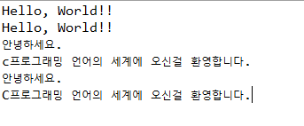

``` java
public class Ex01 {
	public static void main(String[] args){
        // 기본 출력
        System.out.println("Hello, World!!");
        
        // 줄바꿈 기호
        System.out.print("Hello, World!!\n");
        
        // 응용
        System.out.print("안녕하세요.\n c프로그래밍 언어의 세계에 오신걸 환영합니다.");
        // 밑과 똑같이 출력
       	System.out.print("안녕하세요.");
        System.out.println("C프로그래밍 언어의 세계에 오신걸 환영합니다.");
    }
}
```

